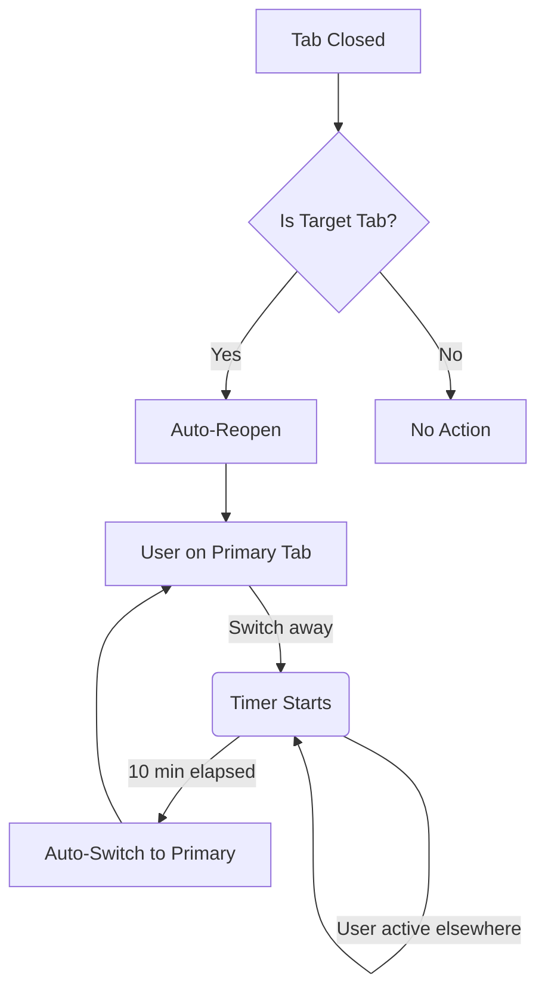

# Tab Keeper - Chrome Extension

[](https://chromewebstore.google.com/detail/tab-keeper/jlaiolmcjkaipeccefpmmliacjbmeadf)
[](https://opensource.org/licenses/MIT)
[](ENTERPRISE_DEPLOYMENT.md)

## Latest Release: v1.0.17

**📅 Released:** June 18, 2026  
**🚀 Chrome Web Store:** 🔄 Ready for Submission

### ✨ What's New in v1.0.17

| Feature | Description |
|---------|-------------|
| 🎨 **Modern UI/UX** | Beautiful gradient purple theme with glassmorphism effects |
| 🖼️ **New Logo** | Fresh gradient design with tab/bookmark motif |
| 🔐 **Auto-Login Fix** | Properly clicks submit button (triggers JS validation) |
| 🎯 **Primary-Only Login** | Auto-login only on primary URL, never secondary |
| 💫 **Improved UX** | Redesigned popup and options page with modern styling |

### Download
- **Chrome Web Store:** https://chromewebstore.google.com/detail/tab-keeper/jlaiolmcjkaipeccefpmmliacjbmeadf
- **GitHub Releases:** https://github.com/zant0p/tab-keeper/releases/latest

---

## Previous: v1.0.16 - Enterprise Release

**📅 Released:** June 17, 2026

| Feature | Description |
|---------|-------------|
| 🏢 **Enterprise Support** | Chrome Admin Console policy configuration |
| 🎯 **Dual Tab Monitoring** | Primary + Secondary target URLs |
| 🔄 **Auto-Reopen** | Automatically reopens target tabs if closed |
| ⭐ **Smart Timer** | Only primary tab is "safe zone" - timer runs everywhere else |
| 💾 **Persistent Storage** | Enterprise policies survive cache clears & restarts |
| ✅ **Backward Compatible** | All previous v1.0.15 features retained |

### Download
- **Chrome Web Store:** https://chromewebstore.google.com/detail/tab-keeper/jlaiolmcjkaipeccefpmmliacjbmeadf
- **GitHub Releases:** https://github.com/zant0p/tab-keeper/releases/latest

---

## 📖 Overview

**Tab Keeper** keeps your important tabs alive and accessible. Perfect for kiosks, monitoring stations, and enterprise deployments where specific web apps need to stay open and logged in.

### 🎯 How It Works

```
┌─────────────────────────────────────────────────────────────┐
│  ⭐ PRIMARY TAB (Safe Zone)                                 │
│  └─ Timer stops here - your "home base"                    │
│                                                             │
│  🔹 SECONDARY TAB (Monitored)                               │
│  └─ Auto-reopens if closed, but timer still runs           │
│                                                             │
│  ⏰ SMART TIMER (1-60 min)                                  │
│  └─ Away from primary? Timer starts → Auto-switch back     │
│                                                             │
│  🔄 AUTO-REOPEN                                             │
│  └─ Closed a target tab? We reopen it automatically        │
│                                                             │
│  🔐 AUTO-LOGIN                                              │
│  └─ Credentials auto-filled on login pages                 │
└─────────────────────────────────────────────────────────────┘
```

### 🏢 Enterprise Ready

Built for Chrome Enterprise environments:
- **Managed Guest Sessions**: Policies survive restarts & cache clears
- **Admin Console Deployment**: Force-install + pre-configure
- **Centralized Management**: Update all devices from one place
- **No User Configuration Needed**: Set it once, deploy everywhere

👉 See [ENTERPRISE_DEPLOYMENT.md](ENTERPRISE_DEPLOYMENT.md) for complete deployment guide.

---

## ✨ Features

| Icon | Feature | Description |
|------|---------|-------------|
| ⭐ | **Primary Tab Safe Zone** | Timer only stops on primary URL - your anchor tab |
| 🔹 | **Secondary Monitoring** | Optional 2nd tab monitored & auto-reopened |
| 🔄 | **Auto-Reopen** | Target tabs reopen automatically if closed |
| ⏰ | **Smart Timer** | Configurable 1-60 min inactivity timer |
| 🔐 | **Auto-Login** | Credentials auto-filled on login detection |
| 📊 | **Status Popup** | Real-time status & countdown display |
| 🏢 | **Enterprise Policies** | Admin Console deployment & management |
| 💾 | **Persistent Config** | Survives cache clears & restarts (managed) |

## Installation

### Option 1: Load Unpacked (Development)

1. Open Chrome and go to `chrome://extensions/`
2. Enable **Developer mode** (toggle in top-right)
3. Click **Load unpacked**
4. Select the `tab-keeper` folder (wherever you cloned/downloaded it)
5. Extension icon should appear in toolbar

### Option 2: Package as CRX (For Distribution)

1. Go to `chrome://extensions/`
2. Enable **Developer mode**
3. Click **Pack extension**
4. Set extension root to the `tab-keeper` folder
5. Click **Pack Extension**
6. Install the generated `.crx` file

## Configuration

### For Individual Users

1. Right-click the extension icon → **Options**
2. Or click the icon → **⚙️ Settings**

### For Enterprise Administrators

See [ENTERPRISE_DEPLOYMENT.md](ENTERPRISE_DEPLOYMENT.md) for Chrome Admin Console deployment, policy configuration, and managed guest session setup.

### Required Settings

| Setting | Description |
|---------|-------------|
| **Enable Tab Keeper** | Toggle the extension on/off |
| **Primary URL ⭐** | The main URL to keep active (only "safe zone") |
| **Secondary URL** | Optional second URL to monitor & auto-reopen |
| **Return Timer** | Minutes before switching back to primary (1-60) |
| **Username** | Auto-login username/email |
| **Password** | Auto-login password |

## 🔄 How It Works



**Step-by-step:**

1. **👀 Monitor**: Extension watches which tab is active in real-time
2. **⏱️ Timer Start**: Switch away from **primary tab** → timer begins (secondary is NOT safe)
3. **🔄 Auto-Switch**: Timer expires → extension switches back to **primary tab only**
4. **♻️ Auto-Reopen**: Primary or secondary tab closed → automatically reopened
5. **🔐 Login Check**: Login page detected → credentials auto-filled
6. **🔁 Repeat**: Continuous monitoring in background service worker

## Security Notes

⚠️ **Credentials are stored locally** in Chrome's storage API:
- Not synced to Google account
- Not transmitted anywhere
- Accessible only by this extension
- Stored in plain text (Chrome storage is not encrypted)

**Recommendations:**
- Use a dedicated Chrome profile for kiosk/monitoring use
- Don't use this with highly sensitive accounts
- Clear credentials when no longer needed

## Files

```
tab-keeper/
## 📁 Project Structure

```
tab-keeper/
├── 📄 manifest.json           # Extension manifest (v3) + managed schema
├── ⚙️  background.js            # Service worker - tab monitoring & timer logic
├── 🔐 content.js              # Content script - login detection & auto-fill
├── 🎨 popup.html/js           # Quick status popup UI
├── ⚙️  options.html/js          # Settings page + managed policy support
├── 📊 managed_storage_schema.json  # Enterprise policy definitions
├── 🏢 ENTERPRISE_DEPLOYMENT.md   # Admin Console deployment guide
└── 📖 README.md               # This file
```

## Troubleshooting

### Extension not switching back
- Check that Target URL is correctly configured
- Ensure extension is enabled in Options
- Check Chrome's extension permissions (tabs, storage, alarms)

### Auto-login not working
- Verify username/password are saved in Options
- Some sites use custom login forms - may need site-specific selectors
- Check browser console for errors (F12 → Console)

### Timer not starting
- Extension only tracks active tab in focused window
- Switching windows may not trigger timer immediately
- Check `chrome://extensions/` → Tab Keeper → Service Worker for logs

## Permissions Explained

| Permission | Why It's Needed |
|------------|-----------------|
| `tabs` | Monitor and switch between tabs |
| `storage` | Save settings and credentials |
| `alarms` | Periodic background checks |
| `activeTab` | Access current tab for login detection |
| `<all_urls>` | Inject login script on any site |

## 📜 Version History

### <kbd>v1.0.17</kbd> (June 18, 2026) - 🎨 **UI/UX + Auto-Login Fix**

**Major Improvements:**
- 🎨 Complete UI/UX redesign with modern gradient purple theme
- 🖼️ New app icon with gradient design and tab/bookmark motif
- ✨ Glassmorphism effects in popup and options page
- 🔐 Auto-login fix: Properly clicks submit button (triggers JS validation)
- 🎯 Auto-login only on primary URL (never secondary)
- 💫 Better React/Angular compatibility with focus/blur events
- 📱 Improved visual hierarchy and modern styling throughout

**Best for:** All users - improved UX and reliable auto-login

---

### <kbd>v1.0.16</kbd> (June 17, 2026) - 🏢 **Enterprise Release**

**Major Features:**
- 🏢 Chrome Enterprise managed storage support (`chrome.storage.managed`)
- 🎯 Dual tab monitoring: Primary + Secondary URLs
- 🔄 Auto-reopen target tabs if closed
- ⭐ Smart timer: Only primary tab stops the timer
- 💾 Enterprise policies for Admin Console deployment
- 📄 New: `ENTERPRISE_DEPLOYMENT.md` guide
- 🔧 Managed storage schema for policy configuration

**Best for:** Kiosks, Managed Guest Sessions, Enterprise deployments

---

### <kbd>v1.0.15</kbd> (June 2, 2026) - ✅ **Production Release**

**Improvements:**
- ✅ Fixed auto-login to only trigger on target website
- 📧 Updated contact email to zantop@protonmail.com
- 🧹 Removed experimental code for Chrome Web Store compliance
- 🔧 Fixed GitHub Actions build workflow
- ⏱️ Improved timer reliability with Chrome Alarms API

**Status:** ✅ Live on Chrome Web Store

---

### <kbd>v1.0.5</kbd> (May 27, 2026)
- Fixed timer persistence issues
- Improved activity tracking

### v1.0.4 (May 27, 2026)
- Added debug logging for tab switching

### v1.0.3 (May 27, 2026)
- Fixed inconsistent auto-login behavior

### v1.0.2 (May 27, 2026)
- Added persistent timer across browser restarts

### v1.0.1 (May 27, 2026)
- Bug fixes for auto-login timing

### v1.0.0 (April 8, 2026) - Initial Release
- Tab monitoring with configurable timer
- Auto-login with credential storage
- Settings page and status popup

## Support & Contact

**Email:** zantop@protonmail.com  
**GitHub:** https://github.com/zant0p/tab-keeper  
**Issues:** https://github.com/zant0p/tab-keeper/issues  
**Chrome Web Store:** https://chromewebstore.google.com/detail/tab-keeper/jlaiolmcjkaipeccefpmmliacjbmeadf

For bugs, feature requests, or questions, please open a GitHub issue or contact via email.

### 📊 Tracking Downloads & Reviews

- **Downloads:** View in Chrome Web Store Developer Dashboard → Analytics
- **Reviews:** Monitor Chrome Web Store Developer Dashboard → Ratings & Reviews
- **GitHub Activity:** Tracked via GitHub Actions (issues/PRs notify automatically)

---

## License

MIT - Feel free to modify and distribute.
