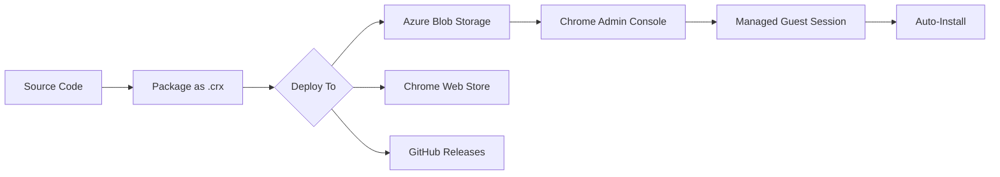
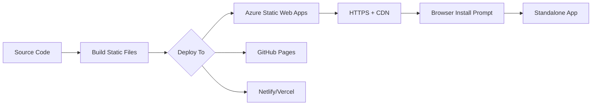

# Tab Keeper - Deployment Architecture

## Dual Deployment Strategy

```
┌─────────────────────────────────────────────────────────────┐
│                    Tab Keeper v2.0.0                        │
│                   Shared Codebase                           │
├─────────────────────────────────────────────────────────────┤
│  • background.js        • popup.html                        │
│  • content.js           • popup.js                          │
│  • options.html         • options.js                        │
│  • manifest.json        • icons/                            │
└─────────────────────────────────────────────────────────────┘
                              │
              ┌───────────────┴───────────────┐
              │                               │
              ▼                               ▼
    ┌─────────────────┐             ┌─────────────────┐
    │  Chrome         │             │  Progressive    │
    │  Extension      │             │  Web App (PWA)  │
    │                 │             │                 │
    │  .crx file      │             │  Web hosting    │
    │  Enterprise     │             │  Mobile-ready   │
    │  Managed        │             │  Offline        │
    └─────────────────┘             └─────────────────┘
              │                               │
              ▼                               ▼
    ┌─────────────────┐             ┌─────────────────┐
    │ Deployment:     │             │ Deployment:     │
    │ • Azure Blob    │             │ • Azure Static  │
    │ • Chrome Web    │             │ • GitHub Pages  │
    │   Store         │             │ • Netlify       │
    │ • Self-hosted   │             │ • Vercel        │
    └─────────────────┘             └─────────────────┘
              │                               │
              ▼                               ▼
    ┌─────────────────┐             ┌─────────────────┐
    │ Target Devices: │             │ Target Devices: │
    │ • Enterprise    │             │ • Mobile (iOS)  │
    │   Desktops      │             │ • Mobile (And.) │
    │ • Kiosks        │             │ • Personal      │
    │ • MGS Sessions  │             │ • Testing       │
    └─────────────────┘             └─────────────────┘
```

---

## File Structure

```
tab-keeper/
│
├── 📄 manifest.json          # Extension manifest (MV3)
├── 📄 manifest.webmanifest   # PWA manifest
│
├── 🔧 background.js          # Service worker (extension)
├── 🔧 sw-pwa.js              # Service worker (PWA)
│
├── 🎨 popup.html             # Extension popup UI
├── 🎨 options.html           # Settings page (both)
│
├── ⚙️ popup.js               # Popup logic
├── ⚙️ options.js             # Settings logic
├── ⚙️ content.js             # Auto-login scripts
├── ⚙️ pwa-install.js         # PWA install handler
│
├── 🖼️ icons/
│   ├── icon16.png
│   ├── icon48.png
│   ├── icon128.png
│   ├── icon192.png           # PWA icon
│   └── icon512.png           # PWA icon
│
├── 📦 dist/                  # Extension build output
│   ├── tab-keeper-2.0.0.zip
│   ├── updates.xml
│   └── DEPLOYMENT-INFO.txt
│
├── 📦 dist-pwa/              # PWA build output
│   ├── index.html
│   ├── manifest.webmanifest
│   ├── sw-pwa.js
│   └── icons/
│
└── 📖 docs/
    ├── PWA-QUICK-START.md
    ├── PWA-DEPLOYMENT.md
    ├── AZURE-BLOB-STORAGE-DEPLOYMENT.md
    ├── CRX-ERROR-FIX-AZURE-GITHUB.md
    ├── MANAGED-GUEST-SESSION-POLICIES.md
    └── DEPLOYMENT-ARCHITECTURE.md
```

---

## Feature Comparison

| Feature | Extension | PWA | Notes |
|---------|-----------|-----|-------|
| **Tab Management** | ✅ Full | ❌ None | Extension has `chrome.tabs` API |
| **Auto-Login** | ✅ Yes | ❌ Manual | Content scripts only in extension |
| **Background Worker** | ✅ Always on | ⚠️ Limited | PWA SW has lifecycle limits |
| **Storage** | ✅ `chrome.storage` | ✅ `localStorage` | Different APIs |
| **Offline** | ❌ No | ✅ Yes | PWA Service Worker caching |
| **Install Required** | ✅ Yes | ✅ Yes | Both installable |
| **Enterprise Policy** | ✅ Full | ❌ No | Extension only |
| **Mobile Support** | ❌ Desktop | ✅ iOS/Android | PWA works everywhere |
| **Auto-Update** | ✅ Chrome WS | ✅ Service Worker | Both auto-update |
| **Push Notifications** | ❌ No | ✅ Ready | PWA has push API |
| **Home Screen Icon** | ⚠️ Desktop | ✅ Mobile+Desktop | PWA better mobile support |
| **Standalone Window** | ✅ Yes | ✅ Yes | Both open without browser UI |

---

## Deployment Workflows

### Extension Workflow



### PWA Workflow



---

## Update Strategies

### Extension Updates

1. **Version bump** in `manifest.json`
2. **Re-package** `.crx` file
3. **Upload** to hosting (Azure/GitHub)
4. **Update** `updates.xml`
5. **Chrome checks** every few hours
6. **Auto-installs** silently (enterprise)

### PWA Updates

1. **Version bump** in `manifest.webmanifest`
2. **Update** cache name in `sw-pwa.js`
3. **Deploy** new files to web server
4. **Service Worker** detects change
5. **Installs** new version in background
6. **Activates** on next page load

---

## Security Considerations

### Extension
- ✅ Signed with PEM key
- ✅ Chrome Web Store review (if published)
- ✅ Enterprise policy enforcement
- ✅ Isolated extension context
- ⚠️ Requires trust in hosting platform

### PWA
- ✅ HTTPS required
- ✅ Same-origin policy
- ✅ Service Worker scope limits
- ⚠️ Less isolated than extension
- ⚠️ Depends on web server security

---

## Performance

### Extension
- **Startup**: Instant (loaded with Chrome)
- **Memory**: Low (background service worker)
- **Network**: Direct API access
- **Storage**: `chrome.storage` (unlimited)

### PWA
- **Startup**: Fast (cached assets)
- **Memory**: Moderate (browser + SW)
- **Network**: Cached + network fallback
- **Storage**: localStorage (5-10MB limit)

---

## Best Practices

### For Extension Deployment
1. Use Enterprise policies for force install
2. Sign CRX with secure PEM key
3. Host on HTTPS with correct MIME types
4. Test in Managed Guest Session
5. Monitor update propagation

### For PWA Deployment
1. Always use HTTPS
2. Pre-cache critical assets
3. Implement offline fallback
4. Handle Service Worker updates gracefully
5. Provide manual install instructions

### Hybrid Approach (Recommended)
1. **Develop** with PWA for fast iteration
2. **Test** functionality in both modes
3. **Deploy** extension for enterprise
4. **Deploy** PWA for mobile/personal
5. **Sync** versions between both

---

## Migration Path

If you need to move from PWA to Extension:

1. Keep shared code (popup, options, styles)
2. Add `chrome.*` API calls
3. Create `manifest.json` (MV3)
4. Package as `.crx`
5. Configure Enterprise policies
6. Deploy alongside PWA (users can choose)

---

## Monitoring & Analytics

Track usage across both platforms:

```javascript
// Shared analytics snippet
const PLATFORM = chrome?.runtime ? 'extension' : 'pwa';
const VERSION = '2.0.0';

analytics.track('app_open', {
  platform: PLATFORM,
  version: VERSION,
  timestamp: Date.now()
});
```

---

## Troubleshooting Matrix

| Issue | Extension Fix | PWA Fix |
|-------|---------------|---------|
| Not installing | Check Enterprise policy | Check HTTPS + manifest |
| Not updating | Force update in chrome://extensions | Clear Service Worker cache |
| Features missing | Check permissions | Check API availability |
| Offline fails | N/A | Check SW registration |
| Can't uninstall | Remove via Admin Console | Browser settings → Apps |

---

**Architecture Version:** 2.0.0  
**Last Updated:** 2026-06-22  
**Status:** Production Ready
