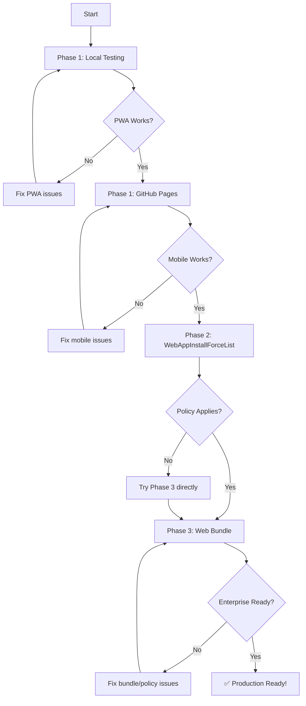

# Tab Keeper PWA - Easy Testing Strategy

## 🎯 Testing Phases (Start Simple, Add Complexity)

### Phase 1: Test as Regular PWA (No Enterprise) ⭐ START HERE
**Time:** 5 minutes  
**Complexity:** Easy  
**Requirements:** None

This tests the PWA functionality **without** Chrome Enterprise policies or web bundles.

#### Option A: Local Testing (Fastest)
```bash
cd /root/.openclaw/workspace/tab-keeper
python3 -m http.server 8080
```

Then open: `http://localhost:8080/options.html`

**What to test:**
- ✅ PWA install prompt appears
- ✅ Installs as standalone app
- ✅ Works offline (DevTools → Network → Offline)
- ✅ Service Worker caches correctly
- ✅ All UI features work

#### Option B: Deploy to Free Hosting (Better for mobile testing)

**GitHub Pages (Recommended):**
```bash
cd /root/.openclaw/workspace/tab-keeper

# Create docs folder for GitHub Pages
mkdir -p docs-pwa
cp options.html popup.html manifest.webmanifest sw-pwa.js pwa-install.js docs-pwa/
cp -r icons docs-pwa/
cp options.js popup.js docs-pwa/

# Push to GitHub
git add docs-pwa/
git commit -m "Add PWA for GitHub Pages testing"
git push origin dev
```

Then enable GitHub Pages:
1. Go to https://github.com/zant0p/tab-keeper/settings/pages
2. Source: Deploy from branch → `dev` → `/docs-pwa`
3. Wait 2-3 minutes
4. Access at: `https://zant0p.github.io/tab-keeper/`

**Netlify (Even Easier):**
1. Drag and drop the `dist-pwa` folder to https://app.netlify.com/drop
2. Get instant HTTPS URL
3. Test on mobile!

---

### Phase 2: Test with Chrome Enterprise Policy (No Web Bundle)
**Time:** 15 minutes  
**Complexity:** Medium  
**Requirements:** Chrome Admin Console access

You can test PWA installation via Enterprise policy **without** creating a web bundle!

#### Use `ExternalStorageDir` Policy

Chrome allows installing PWAs from specific URLs via policy:

**Policy JSON:**
```json
{
  "WebAppInstallForceList": [
    "https://zant0p.github.io/tab-keeper/"
  ]
}
```

**Linux Local Policy:**
File: `/etc/opt/chrome/policies/managed/web-apps.json`

```json
{
  "WebAppInstallForceList": ["https://YOUR_PWA_URL_HERE/"]
}
```

**Permissions:**
```bash
sudo chmod 644 /etc/opt/chrome/policies/managed/web-apps.json
sudo chown root:root /etc/opt/chrome/policies/managed/web-apps.json
```

**Verify:**
1. Go to `chrome://policy/` → Reload policies
2. Check `chrome://web-app-internals/` for installed PWAs
3. PWA should auto-install

⚠️ **Note:** This only works on some Chrome versions. If it doesn't work, proceed to Phase 3.

---

### Phase 3: Test with Web Bundle (Full Enterprise)
**Time:** 30 minutes  
**Complexity:** Advanced  
**Requirements:** web-bundler tool, Chrome Admin Console

This is the **full production deployment** test.

#### Step 1: Install web-bundler
```bash
npm install -g web-bundler
```

#### Step 2: Build Web Bundle
```bash
cd /root/.openclaw/workspace/tab-keeper
./scripts/build-pwa-bundle.sh
```

This creates:
- `dist-pwa/tab-keeper-pwa.webbundle`
- Web Bundle ID (output by script)

#### Step 3: Upload to Azure
```bash
az storage blob upload \
  --account-name YOUR_ACCOUNT \
  --container-name YOUR_CONTAINER \
  --name tab-keeper-pwa.webbundle \
  --file ./dist-pwa/tab-keeper-pwa.webbundle \
  --content-type application/webbundle

az storage blob upload \
  --account-name YOUR_ACCOUNT \
  --container-name YOUR_CONTAINER \
  --name pwa-updates.xml \
  --file ./pwa-updates.xml \
  --content-type application/xml
```

#### Step 4: Configure Chrome Admin Console
```json
{
  "IsolatedWebAppList": [
    {
      "id": "YOUR_WEB_BUNDLE_ID_HERE",
      "update_url": "https://YOUR_ACCOUNT.blob.core.windows.net/YOUR_CONTAINER/pwa-updates.xml"
    }
  ]
}
```

#### Step 5: Verify
1. `chrome://policy/` → Reload policies
2. `chrome://isolated-web-apps/` → Should see Tab Keeper
3. Launch and test!

---

## 🧪 Testing Checklist

### Phase 1 Tests (Regular PWA)
- [ ] PWA loads in browser
- [ ] Install prompt appears (or manual install works)
- [ ] Opens in standalone window (no browser UI)
- [ ] Works offline (disconnect network, reload)
- [ ] Service Worker active (`chrome://serviceworker-internals/`)
- [ ] All buttons/features work
- [ ] Timer functions correctly
- [ ] Settings save/load properly

### Phase 2 Tests (Enterprise Policy)
- [ ] Policy shows as "Mandatory" at `chrome://policy/`
- [ ] PWA auto-installs on policy apply
- [ ] Survives browser restart
- [ ] Updates when source changes

### Phase 3 Tests (Web Bundle)
- [ ] Web Bundle ID generated correctly
- [ ] `.webbundle` uploads with correct MIME type
- [ ] IsolatedWebAppList policy applies
- [ ] Shows in `chrome://isolated-web-apps/`
- [ ] Auto-updates via `pwa-updates.xml`
- [ ] Works in Managed Guest Session

---

## 🛠️ Quick Test Scripts

### Test PWA Locally
Save as `scripts/test-pwa-local.sh`:
```bash
#!/bin/bash
echo "🚀 Starting local PWA test server..."
echo ""
echo "Open: http://localhost:8080/options.html"
echo ""
echo "Press Ctrl+C to stop"
cd /root/.openclaw/workspace/tab-keeper
python3 -m http.server 8080
```

### Test Service Worker
In browser console at `http://localhost:8080/`:
```javascript
// Check if SW registered
navigator.serviceWorker.getRegistrations().then(regs => {
  console.log('Service Workers:', regs);
});

// Check cache
caches.keys().then(names => {
  console.log('Caches:', names);
});

// Force SW update
navigator.serviceWorker.getRegistration().then(reg => {
  if (reg) reg.update();
});
```

### Test PWA Installation Status
In browser console:
```javascript
// Check if running as PWA
if (window.matchMedia('(display-mode: standalone)').matches) {
  console.log('✅ Running as installed PWA');
} else {
  console.log('❌ Not installed as PWA');
}

// Check install prompt availability
window.addEventListener('beforeinstallprompt', (e) => {
  console.log('✅ Install prompt available');
  e.preventDefault();
});
```

---

## 📊 Comparison Table

| Test Method | Time | Complexity | Enterprise Ready | Mobile Test |
|-------------|------|------------|------------------|-------------|
| **Local HTTP** | 1 min | ⭐ Easy | ❌ No | ❌ No |
| **GitHub Pages** | 10 min | ⭐⭐ Medium | ❌ No | ✅ Yes |
| **Netlify Drop** | 5 min | ⭐ Easy | ❌ No | ✅ Yes |
| **WebAppInstallForceList** | 15 min | ⭐⭐⭐ Advanced | ⚠️ Partial | ✅ Yes |
| **Web Bundle + IWA** | 30 min | ⭐⭐⭐⭐ Expert | ✅ Yes | ✅ Yes |

---

## 🎯 Recommended Testing Flow



---

## 💡 Pro Tips

### 1. Test Incrementally
Don't jump straight to web bundles! Test the PWA first without enterprise complexity.

### 2. Use Multiple Devices
- Desktop Chrome for development
- Android Chrome for mobile testing
- iOS Safari for iOS testing (PWA works differently)

### 3. Check These URLs
- `chrome://serviceworker-internals/` - Service Worker status
- `chrome://app-internals/` - Installed apps
- `chrome://web-app-internals/` - Web app details
- `chrome://policy/` - Enterprise policies
- `chrome://isolated-web-apps/` - Isolated Web Apps

### 4. Debug Service Worker
```javascript
// In browser console
navigator.serviceWorker.ready.then(reg => {
  console.log('SW ready:', reg.scope);
  
  // Send message to SW
  reg.active.postMessage({type: 'GET_VERSION'});
});
```

### 5. Clear Cache for Testing
```javascript
// Clear all caches
caches.keys().then(names => {
  names.forEach(name => caches.delete(name));
});
console.log('✅ Caches cleared');
```

---

## 🆘 Common Issues

### PWA Won't Install
- Check HTTPS (or localhost)
- Verify manifest.webmanifest is valid
- Ensure Service Worker registered
- Try Chrome incognito mode

### Policy Not Applying
- Check file permissions (must be root-owned, not world-writable)
- Verify JSON syntax
- Reload policies at `chrome://policy/`
- Check `chrome://management/` shows "managed"

### Web Bundle Fails
- Verify MIME type: `application/webbundle`
- Check Web Bundle ID matches policy
- Ensure `.webbundle` is accessible (public read)
- Check `chrome://isolated-web-apps/` for errors

---

## 📖 Next Steps

1. **Start with Phase 1** (local testing) - 5 minutes
2. **Deploy to GitHub Pages** - Test on mobile
3. **If enterprise needed**, proceed to Phase 3 (web bundle)
4. **Document results** in your deployment notes

---

**Remember:** You don't need web bundles to test PWA functionality! Start simple, add complexity only when needed for enterprise deployment.
